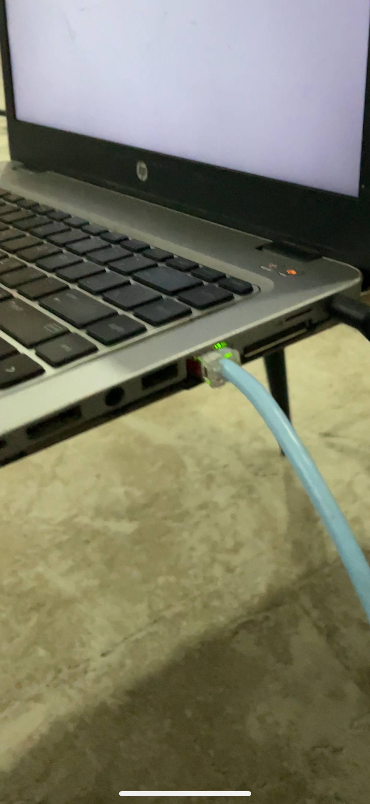
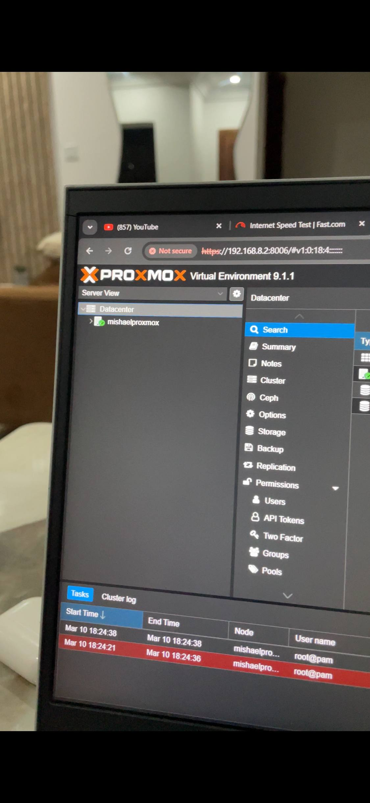
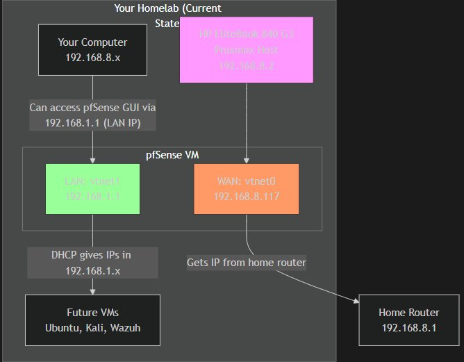

# 🔐 Cybersecurity Homelab

**A self-built, enterprise-grade security lab running on an HP EliteBook 840 G3.**

This repository documents the design, deployment, configuration, and troubleshooting of a personal cybersecurity homelab built from the ground up. Every component was researched, installed, broken, fixed, and documented by me — with the goal of developing real, hands-on skills that mirror enterprise security environments.

> *"This lab is my resume in action."*

---

## 📸 Lab Overview

| The Physical Lab | Proxmox VE Dashboard |
|:---:|:---:|
|  |  |

---

## 🏗️ Architecture at a Glance

```
Internet
   │
Home Router (192.168.100.1)
   │
   ├──► Proxmox Host — mishaelproxmox (192.168.100.2:8006)
   │         │
   │    [vmbr0] ──► pfSense WAN (vtnet0) — 192.168.100.x (DHCP)
   │                     │
   │              [pfSense VM]
   │                     │
   │    [vmbr1] ──► pfSense LAN (vtnet1) — 192.168.1.1/24
   │                     │
   │         ┌───────────┼───────────┐
   │         │           │           │
   │    Ubuntu VM    Kali VM*   Windows VM*
   │   192.168.1.x  192.168.1.x  192.168.1.x
   │
   * = planned
```

**All VM traffic is forced through pfSense before reaching the internet. No VM can bypass the firewall.**

---

## 🗺️ Network Diagram



---

## ⚙️ Technology Stack

| Layer | Technology | Purpose |
|:---|:---|:---|
| Hypervisor | Proxmox VE 9.1.1 | Type-1 hypervisor, VM lifecycle management |
| Firewall / Gateway | pfSense CE 2.7.2 | NAT, firewall rules, DHCP, DNS, VPN endpoint |
| IDS / IPS | Suricata | Real-time traffic inspection and alerting |
| VPN | WireGuard | Encrypted remote access into the lab |
| OS — Server | Ubuntu 24.04 LTS + Xubuntu | Linux server environment |
| Security Tools | Nessus, Nmap, Metasploit, Wireshark | Vulnerability scanning and attack simulation |
| SIEM | Wazuh *(in progress)* | Centralized log ingestion and alerting |
| Attack Platform | Kali Linux *(planned)* | Offensive security simulation |

---

## 📁 Repository Structure

```
cybersecurity-homelab/
│
├── README.md                          ← You are here
│
├── docs/
│   ├── 01-hardware-foundation.md      ← Physical hardware specs and rationale
│   ├── 02-proxmox-setup.md            ← Hypervisor installation and configuration
│   ├── 03-network-architecture.md     ← Dual-bridge network design
│   ├── 04-pfsense-firewall.md         ← Firewall setup, NAT, DHCP, rules
│   ├── 05-suricata-ids.md             ← IDS/IPS deployment and tuning
│   ├── 06-wireguard-vpn.md            ← Remote access VPN configuration
│   ├── 07-troubleshooting-log.md      ← Real problems encountered and solved
│   └── 08-roadmap.md                  ← Planned next phases
│
├── images/                            ← Lab screenshots and diagrams
│
└── configs/                           ← Sample configuration references
    ├── pfsense-firewall-rules.md
    └── wireguard-sample.md
```

---

## 🔑 Key Skills Demonstrated

| Domain | Evidence |
|:---|:---|
| **Virtualization** | Proxmox VE deployed on bare metal with local and LVM storage pools |
| **Network Architecture** | Dual Linux bridge design enforcing full firewall inspection |
| **Firewall Management** | pfSense configured from scratch — interfaces, NAT, DHCP, default-deny rules |
| **IDS / IPS** | Suricata deployed and tuned to reduce false positives |
| **VPN** | WireGuard configured with port forwarding, no management port exposed |
| **Vulnerability Management** | Nessus deployed for internal scanning |
| **Troubleshooting** | 7+ documented real-world issues resolved end to end |
| **Documentation** | Every decision and outcome recorded in structured markdown |

---

## 🗂️ Documentation Index

| # | Document | Description |
|:---|:---|:---|
| 1 | [Hardware Foundation](01-hardware-foundation.md) | Physical specs and why this hardware was chosen |
| 2 | [Proxmox Setup](02-proxmox-setup.md) | Hypervisor install, storage, and networking |
| 3 | [Network Architecture](03-network-architecture.md) | The full dual-bridge segmented design |
| 4 | [pfSense Firewall](04-pfsense-firewall.md) | Firewall configuration from scratch |
| 5 | [Suricata IDS/IPS](05-suricata-ids.md) | Intrusion detection deployment and tuning |
| 6 | [WireGuard VPN](06-wireguard-vpn.md) | Secure remote access setup |
| 7 | [Troubleshooting Log](07-troubleshooting-log.md) | Real failures and how they were fixed |
| 8 | [Roadmap](08-roadmap.md) | What's coming next |

---

## 👤 About

**Mishael Eluehike**
Cybersecurity Analyst | CompTIA Security+ | Cisco CyberOps Associate | BSc Computer Science (First Class Honours)

📧 mishael.elu@gmail.com
🔗 [LinkedIn](https://www.linkedin.com/in/eluehike-mishael-791696259)

---

*This lab is actively maintained and expanded. Last updated: 2025.*
